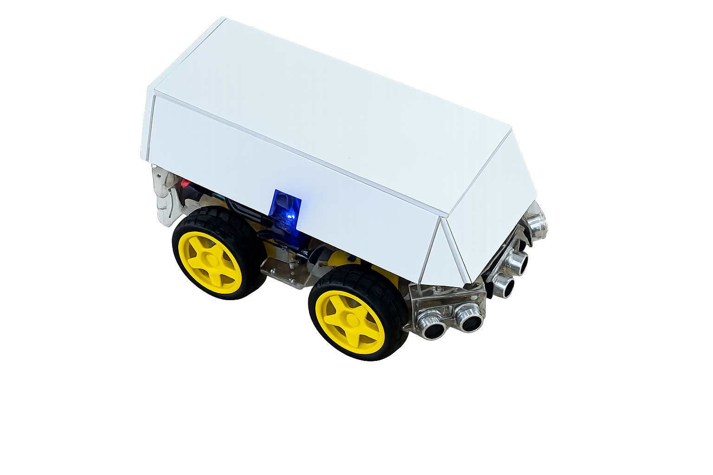
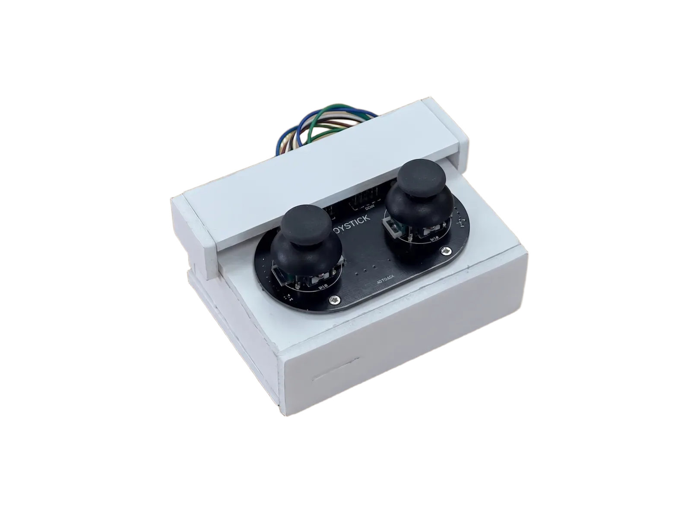
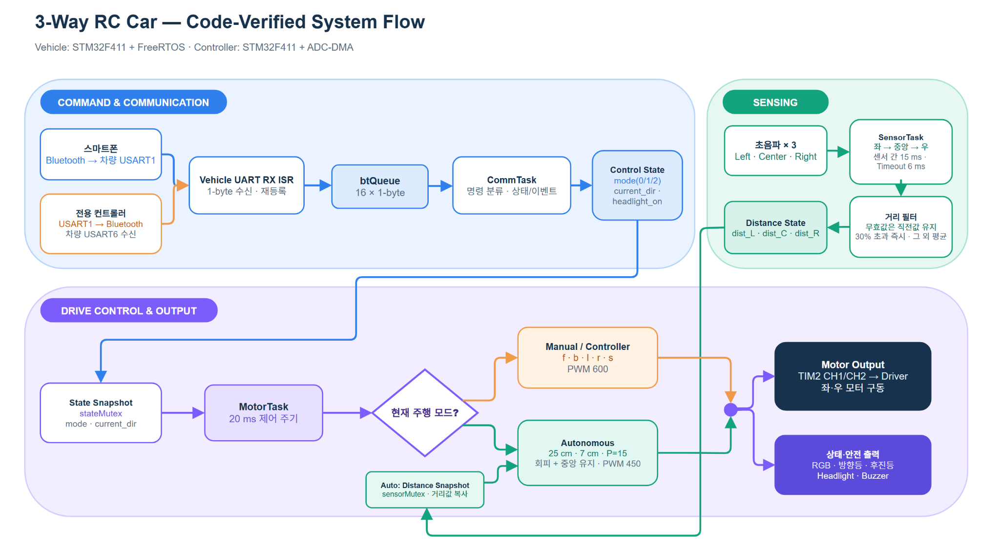

<div align="center">

# 🚗 3-Way RC Car

### Smartphone Control · Autonomous Driving · Physical Controller

<p>
  
  
  
  
</p>

<p>
  
  &nbsp;&nbsp;
  
</p>

**스마트폰 수동 조종, 초음파 기반 자율주행, 전용 조이스틱 컨트롤러를 하나의 차량 플랫폼에 통합한 STM32 임베디드 프로젝트입니다.**

[▶ 주행 시연 영상](https://www.youtube.com/shorts/SejQ_YxX1z0)

</div>

---

## 1. Project Overview

기존 RC Car의 단일 조종 방식에서 확장하여, 사용 환경에 따라 세 가지 주행 모드를 전환할 수 있는 **3-Way Control System**을 구현했습니다.

차량 제어부는 STM32F411과 FreeRTOS를 기반으로 구성했으며, 통신 수신, 초음파 거리 측정, 주행 판단을 각각 독립 Task로 분리했습니다. 자율주행 모드에서는 좌·중앙·우 초음파 센서로 주변 거리를 측정하고, 전방 장애물 회피와 좌우 벽 거리 오차 기반 P 제어를 결합하여 복도형 환경에서 중앙을 유지하도록 설계했습니다.

| 항목 | 내용 |
|---|---|
| 프로젝트 형태 | 개인 임베디드 시스템 프로젝트 |
| 담당 범위 | 기획, 회로 구성, STM32 펌웨어, 제어 알고리즘, 통합 테스트, 문서화 |
| 차량 MCU | STM32F411RE 계열 |
| 컨트롤러 MCU | STM32F411CEU6 계열 |
| RTOS | FreeRTOS / CMSIS-RTOS2 |
| Language | C |
| Development | STM32CubeIDE, STM32CubeMX, STM32 HAL |
| 주요 인터페이스 | UART, ADC, DMA, PWM, GPIO |

---

## 2. Key Features

| 기능 | 구현 내용 |
|---|---|
| **3-Way Control** | 스마트폰 수동 조종, 초음파 자율주행, 전용 컨트롤러 조종 |
| **FreeRTOS Architecture** | `MotorTask`, `SensorTask`, `CommTask` 분리 |
| **Autonomous Driving** | 전방·측면 장애물 회피 및 좌우 거리 기반 P 제어 |
| **Dual UART Input** | 스마트폰 명령과 물리 컨트롤러 명령을 서로 다른 UART로 수신 |
| **Controller ADC + DMA** | 조이스틱 4채널을 ADC Scan 및 Circular DMA로 연속 취득 |
| **Vehicle UX** | 모드 RGB LED, 헤드라이트, 방향지시등, 후진등, 경적, 후진 경고음 |
| **Non-blocking Control** | Queue, Mutex, `HAL_GetTick()` 기반 상태 제어 |

---

## 3. Three-Way Control

| Mode | 입력 장치 | 동작 | 상태 LED |
|---|---|---|---|
| **Manual Mode** | Smartphone Bluetooth | 전진·후진·좌회전·우회전·정지 및 부가기능 제어 | Blue |
| **Autonomous Mode** | Ultrasonic Sensor × 3 | 장애물 회피 및 좌우 거리 균형 기반 자율주행 | Green |
| **Controller Mode** | Dual Joystick Controller | 물리 조이스틱과 버튼을 이용한 차량 제어 | Red |

부팅 시 RGB LED를 1초 동안 흰색으로 점등한 뒤 기본 모드인 Manual Mode의 파란색으로 전환합니다.

---

## 4. System Architecture & Control Flow

<p align="center">
  
</p>

<p align="center">
  <sub>
    스마트폰·전용 컨트롤러 입력부터 FreeRTOS Task, 초음파 센싱,
    자율주행 판단 및 차량 출력까지의 전체 제어 흐름
  </sub>
</p>

<p align="center">
  <a href="./docs/3-Way_RC_Car_Flowchart.drawio">Draw.io 원본 보기</a>
</p>

### Control Flow

1. 스마트폰 또는 전용 컨트롤러가 ASCII 1-byte 명령을 전송합니다.
2. UART 수신 인터럽트가 명령을 FreeRTOS Message Queue에 저장합니다.
3. `CommTask`가 명령을 해석하여 주행 모드와 방향 상태를 갱신합니다.
4. `SensorTask`가 3개의 초음파 센서를 순차 측정하고 거리값을 필터링합니다.
5. `MotorTask`가 모드와 센서 상태를 종합해 모터, 조명, 부저를 제어합니다.

---

## 5. FreeRTOS Design

### Task Configuration

| Task | Priority | 역할 |
|---|---:|---|
| `SensorTask` | Above Normal | 좌·중앙·우 초음파 거리 순차 측정 및 필터링 |
| `MotorTask` | Normal | 모드별 주행 판단, 모터 PWM, 조명 및 부저 갱신 |
| `CommTask` | Normal | Queue에서 명령을 수신해 모드와 방향 상태 변경 |

### Synchronization

| Object | Type | 역할 |
|---|---|---|
| `btQueue` | Message Queue, 16 × 1-byte message | UART ISR에서 `CommTask`로 1-byte 명령 전달 |
| `stateMutex` | Mutex | 주행 모드와 현재 방향 상태 보호 |
| `sensorMutex` | Mutex | 좌·중앙·우 거리값 보호 |

`MotorTask`는 20 ms 주기로 제어 출력을 갱신합니다. `CommTask`는 Queue에 새 명령이 도착할 때까지 대기하는 Event-driven 구조이며, UART ISR에서는 명령 해석 대신 Queue 전달만 수행합니다.

---

## 6. Autonomous Driving Algorithm

### 6.1 Decision Priority

```text
1. Center distance < 25 cm
   └─ 좌우 중 더 넓은 방향으로 제자리 회전

2. Left distance < 7 cm
   └─ 우측으로 긴급 회전

3. Right distance < 7 cm
   └─ 좌측으로 긴급 회전

4. Safe area
   └─ 좌우 거리 오차 기반 P 제어 직진
```

### 6.2 Continuous P-Control

```c
error  = left_distance - right_distance;

if (-2 <= error && error <= 2)
    error = 0;

offset = clamp(error * 15, -200, 200);

left_pwm  = 450 - offset;
right_pwm = 450 + offset;
```

| Parameter | Value | Description |
|---|---:|---|
| `FRONT_SAFE_CM` | 25 cm | 전방 장애물 회피 기준 |
| `SIDE_EMERGENCY_CM` | 7 cm | 측면 긴급 회피 기준 |
| `SPEED_BASE` | 450 | 자율주행 기본 PWM |
| `SPEED_SPIN` | 450 | 회피 회전 PWM |
| `SPEED_MANUAL` | 600 | 수동 및 컨트롤러 모드 PWM |
| `P_GAIN` | 15 | 좌우 거리 오차 보정 계수 |
| `MAX_STEER_OFFSET` | ±200 | 최대 조향 보정량 |
| Deadband | ±2 cm | 작은 오차에 의한 좌우 흔들림 억제 |

### 6.3 Ultrasonic Measurement and Filtering

각 초음파 센서는 DWT Cycle Counter 기반 마이크로초 타이밍으로 측정하며, Echo 시작과 High 구간에 각각 6,000 µs Timeout을 적용합니다. 센서 간 간섭을 줄이기 위해 좌·중앙·우 센서를 순차 측정하고 각 측정 사이에 15 ms 간격을 둡니다.

필터는 급격한 환경 변화와 작은 측정 노이즈를 구분하도록 구현했습니다.

```c
if (current == 0 || current > 400)
    return previous;

if (previous == 0)
    return current;

if (abs(current - previous) > previous * 0.3)
    return current;

return (previous + current) / 2;
```

- 무응답 또는 유효 범위 초과 값은 직전 정상값 유지
- 이전 값 대비 30%를 초과하는 변화는 실제 장애물 변화로 판단해 즉시 반영
- 작은 변화는 이전값과 현재값을 50:50으로 평균하여 노이즈 완화

---

## 7. Physical Controller

전용 컨트롤러는 STM32F411의 ADC1을 Scan Conversion으로 설정하고, 4개 아날로그 채널을 DMA2 Stream0 Circular Mode로 지속 수집합니다.

```text
adc_buf[0] = Joystick 1 X
adc_buf[1] = Joystick 1 Y
adc_buf[2] = Joystick 2 X
adc_buf[3] = Joystick 2 Y
```

현재 주행 판정에는 Joystick 1 Y축과 Joystick 2 X축을 사용합니다.

| Code-level Condition | Transmitted Command | Vehicle Action |
|---|---|---|
| `Joy1 Y > 3000` | `f` | Forward |
| `Joy1 Y < 1000` | `b` | Backward |
| `Joy2 X > 3000` | `l` | Left |
| `Joy2 X < 1000` | `r` | Right |
| 중앙 구간 | `s` | Stop |

> 위 표는 실제 UART로 송신되는 명령 문자를 기준으로 작성했습니다. 조이스틱의 물리적 장착 방향이나 배선 방향에 따라 축의 체감 방향은 달라질 수 있습니다.

### Controller Buttons

| Input | GPIO | Transmission |
|---|---|---|
| Joystick 1 Button | PB12, Pull-up | `H` — Horn |
| Joystick 2 Button | PB13, Pull-up | `T` — Headlight Toggle |

버튼은 눌리는 순간의 Edge를 감지하여 한 번만 전송합니다. 방향 명령 역시 이전 명령과 달라진 경우에만 전송하며, 입력 루프는 50 ms 주기로 동작하여 불필요한 UART 트래픽을 줄였습니다.

---

## 8. Command Protocol

차량은 디버깅이 쉬운 ASCII 1-byte 명령 프로토콜을 사용합니다.

| Command | Function |
|---|---|
| `A` / `a` | Autonomous Mode |
| `M` / `m` | Smartphone Manual Mode |
| `C` / `c` | Physical Controller Mode |
| `f` / `F` | Forward |
| `b` / `B` | Backward |
| `l` / `L` | Left |
| `r` / `R` | Right |
| `s` / `S` | Stop |
| `H` / `h` | Horn |
| `T` | Headlight Toggle |

헤드라이트 명령은 좌회전 명령 `L`과 충돌하지 않도록 별도 문자 `T`로 분리했습니다.

---

## 9. Vehicle UX and Safety Functions

| 기능 | 구현 방식 |
|---|---|
| Mode Indicator | Manual: Blue, Autonomous: Green, Controller: Red |
| Welcome Light | 부팅 시 White LED 1초 점등 |
| Headlight | `T` 명령으로 ON/OFF Toggle |
| Turn Signal | 좌·우 회전 중 해당 전방 LED를 500 ms 주기로 점멸 |
| Rear Light | 후진 상태에서 후방 LED 점등 |
| Horn | TIM3 PWM으로 430 Hz와 480 Hz를 빠르게 교차하는 400 ms 경적 |
| Reverse Warning | 후진 중 300 ms 간격으로 반복 경고음 |
| Non-blocking Update | `HAL_GetTick()` 기반 부저 및 방향지시등 상태 갱신 |

---

## 10. Hardware and Peripheral Mapping

### Vehicle

| Peripheral | Usage |
|---|---|
| STM32F411RE | 차량 메인 제어 및 FreeRTOS 실행 |
| TIM2 CH1 / CH2 | 좌·우 구동 채널 PWM |
| TIM3 CH3 | 부저 PWM |
| USART1, 9600 bps | 스마트폰 Bluetooth 명령 수신 |
| USART6, 9600 bps | 전용 컨트롤러 Bluetooth 명령 수신 |
| GPIO | 모터 방향, 초음파 Trigger/Echo, RGB 및 차량 조명 |
| Ultrasonic Sensor × 3 | 좌·중앙·우 거리 측정 |
| Motor Driver | 좌·우 구동 채널 방향 및 속도 제어 |

### Controller

| Peripheral | Usage |
|---|---|
| STM32F411CEU6 | 조이스틱 입력 처리 및 명령 송신 |
| ADC1 IN0–IN3 | 조이스틱 4채널 12-bit 입력 |
| DMA2 Stream0 | ADC Circular DMA |
| USART1, 9600 bps | 차량 제어 명령 송신 |
| PB12 / PB13 | 경적 및 헤드라이트 버튼 입력 |
| Dual Joystick | 전후·좌우 주행 입력 |

---

## 11. Troubleshooting

| Problem | Cause | Applied Solution |
|---|---|---|
| 자율주행 중 좌우 흔들림 | 작은 거리 오차에도 조향 보정 발생 | ±2 cm Deadband 적용 |
| 급격한 조향 및 오버슈트 | P 제어 보정량이 과도하게 증가 | 조향 보정량을 ±200으로 Clamp |
| 센서 무응답 시 무한 대기 | Echo 신호가 시작되지 않거나 High 상태로 고정 | Echo 구간별 6,000 µs Timeout 적용 |
| 초음파 센서 간 간섭 | 3개 센서를 연속으로 동시에 Trigger | 좌·중앙·우 순차 측정 및 15 ms 간격 적용 |
| 거리값 순간 튐 | 반사 환경에 따른 작은 측정 노이즈 | 작은 변화는 50:50 평균, 30% 초과 변화는 즉시 반영 |
| 조명과 좌회전 명령 충돌 | 헤드라이트와 좌회전에 동일 문자 `L` 사용 가능성 | 헤드라이트 Toggle을 `T`로 분리 |
| UART ISR 처리 지연 | 인터럽트 안에서 직접 명령 해석 및 모터 제어 | ISR은 Queue 전달만 수행하고 `CommTask`에서 해석 |
| Task 간 공유 데이터 충돌 | 센서값과 주행 상태를 여러 Task가 동시에 접근 | `sensorMutex`, `stateMutex` 적용 |
| 불필요한 UART 트래픽 | 동일 방향 명령을 매 Loop마다 반복 송신 | 방향이 바뀔 때만 전송하도록 변경 |
| 부저 동작 중 주행 지연 | Delay 기반 음향 패턴이 Task를 Blocking | `HAL_GetTick()` 기반 Non-blocking 상태 제어 |

---

## 12. Repository Structure

```text
RC_Car_Project/
├── assets/
│   ├── rc_car.png                # 완성 차량 이미지
│   ├── controller.png            # 전용 컨트롤러 이미지
│   └── system_flow.png           # 전체 시스템 아키텍처 및 제어 흐름
│
├── docs/
│   └── 3-Way_RC_Car_Flowchart.drawio  # 편집 가능한 Draw.io 원본
│
├── RC_Car/
│   ├── Inc_code/                 # 차량 펌웨어 Header
│   ├── Src_code/
│   │   ├── bluetooth.c           # USART1/USART6 RX Interrupt 및 Queue 전달
│   │   ├── buzzer.c              # 경적·후진 경고음 상태 제어
│   │   ├── delay.c               # DWT 기반 Microsecond Timing
│   │   ├── freertos.c            # Task, Queue, Mutex, 자율주행 로직
│   │   ├── gpio.c                # 차량 GPIO 초기화
│   │   ├── led.c                 # RGB Mode Indicator
│   │   ├── main.c                # 주변장치 초기화 및 Scheduler 시작
│   │   ├── motor.c               # 모터 방향 및 차등 PWM 제어
│   │   ├── tim.c                 # 모터·부저 PWM Timer 설정
│   │   ├── ultrasonic.c          # 초음파 거리 측정 및 Timeout
│   │   └── usart.c               # USART1 / USART6 설정
│   └── MX_setting/
│       └── RC_Car.pdf            # STM32CubeMX 설정 리포트
│
├── Controller/
│   ├── Inc_code/                 # 컨트롤러 펌웨어 Header
│   ├── Src_code/
│   │   ├── adc.c                 # ADC1 4채널 Scan 및 DMA 연동
│   │   ├── dma.c                 # DMA2 Stream0 설정
│   │   ├── gpio.c                # PB12/PB13 Pull-up 버튼 설정
│   │   ├── main.c                # 조이스틱·버튼 판정 및 명령 송신
│   │   └── usart.c               # USART1 9600 bps 설정
│   └── MX_setting/
│       └── Controller.pdf        # STM32CubeMX 설정 리포트
│
└── README.md
```

---

## 13. Key Source Files

| File | Description |
|---|---|
| [`RC_Car/Src_code/freertos.c`](./RC_Car/Src_code/freertos.c) | 3-Way 모드, RTOS 구조, 장애물 회피 및 P 제어 |
| [`RC_Car/Src_code/bluetooth.c`](./RC_Car/Src_code/bluetooth.c) | USART1·USART6 수신 인터럽트와 Message Queue 연동 |
| [`RC_Car/Src_code/ultrasonic.c`](./RC_Car/Src_code/ultrasonic.c) | 좌·중앙·우 거리 측정 및 Echo Timeout |
| [`RC_Car/Src_code/motor.c`](./RC_Car/Src_code/motor.c) | 전진·후진·제자리 회전 및 차등 PWM |
| [`RC_Car/Src_code/buzzer.c`](./RC_Car/Src_code/buzzer.c) | Non-blocking 경적 및 후진 경고음 |
| [`Controller/Src_code/main.c`](./Controller/Src_code/main.c) | 조이스틱·버튼 판정 및 변화 기반 UART 송신 |
| [`Controller/Src_code/adc.c`](./Controller/Src_code/adc.c) | ADC1 4채널 Scan과 Circular DMA |

---

## 14. Result and Learning

### Result

- 스마트폰, 자율주행, 전용 컨트롤러의 **세 가지 주행 모드 통합**
- 전방·측면 장애물 회피와 좌우 거리 균형 기반 자율주행 구현
- FreeRTOS Queue와 Mutex를 활용한 통신·센서·주행 로직 분리
- ADC Scan과 Circular DMA를 활용한 조이스틱 연속 입력 처리
- RGB 상태 표시, 경적, 후진 경고음, 헤드라이트, 방향지시등, 후진등 통합
- 기능별 모듈화를 통한 유지보수성과 디버깅 편의성 확보

### What I Learned

- FreeRTOS Task 분할과 Priority 설계
- UART Interrupt와 Message Queue를 이용한 ISR–Task 분리
- Mutex 기반 공유 데이터 동기화
- ADC Scan Conversion과 Circular DMA 활용
- PWM 기반 Differential Drive 제어
- 실제 초음파 센서 노이즈를 고려한 Timeout 및 필터 설계
- P 제어 파라미터와 회피 조건을 실제 주행 환경에 맞춰 튜닝하는 과정

---

## 15. Future Improvements

- 통신 Timeout 발생 시 자동 정지하는 Fail-safe 로직 추가
- Watchdog을 이용한 펌웨어 비정상 상태 복구
- 엔코더 피드백 기반 좌·우 모터 속도 폐루프 제어
- P 제어를 PD 또는 PID 제어로 확장
- 명령 패킷에 Header, Checksum, Sequence Number 추가
- 배터리 전압 모니터링 및 저전압 경고 기능 추가

---

## 16. Repository Scope

본 저장소는 포트폴리오 코드 리뷰를 목적으로 핵심 Source/Header 파일과 STM32CubeMX 설정 리포트를 정리한 저장소입니다. 전체 STM32CubeIDE 자동 생성 프로젝트가 포함된 형태가 아니므로, 다른 환경에서 재현할 때는 각 `MX_setting` 리포트를 기준으로 주변장치와 핀 설정을 구성해야 합니다.

---

<div align="center">

**Embedded Firmware · FreeRTOS · Motor Control · Sensor Processing**

GitHub: [@kimdk1005-collab](https://github.com/kimdk1005-collab)

</div>
