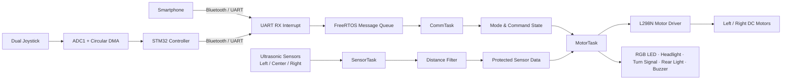

<div align="center">

# 🚗 3-Way RC Car

### Smartphone Control · Autonomous Driving · Physical Controller

<p>
  
  
  
  
</p>

**하나의 RC Car 플랫폼에 스마트폰 수동 조종, 초음파 기반 자율주행, 전용 조이스틱 컨트롤러 제어를 통합한 임베디드 시스템 프로젝트입니다.**

[▶ 주행 시연 영상](https://www.youtube.com/shorts/SejQ_YxX1z0)

</div>

---

## 1. Project Overview

기존 RC Car의 단일 조종 방식에서 확장하여, 사용 환경에 따라 제어 방식을 즉시 전환할 수 있는 **3-Way 주행 시스템**을 구현했습니다.

차량 제어부에는 STM32F411과 FreeRTOS를 적용하고, 통신·센서 측정·모터 제어를 독립 Task로 분리했습니다. 자율주행 모드에서는 좌·중앙·우 초음파 센서로 주변 거리를 측정하고, 전방 장애물 회피와 좌우 거리 오차 기반 P 제어를 결합하여 주행 안정성을 높였습니다.

| 항목 | 내용 |
|---|---|
| 프로젝트 형태 | 개인 임베디드 시스템 프로젝트 |
| 담당 범위 | 기획, 회로 구성, STM32 펌웨어, 제어 알고리즘, 통합 테스트, 문서화 |
| 차량 MCU | STM32F411RE 계열 |
| 컨트롤러 MCU | STM32F411CEU6 계열 |
| RTOS | FreeRTOS / CMSIS-RTOS2 |
| Language | C |
| Development | STM32CubeIDE, STM32CubeMX, STM32 HAL |
| 주요 인터페이스 | UART, ADC, DMA, PWM, GPIO |

---

## 2. Key Features

### 2.1 Three-Way Control

| Mode | 제어 방식 | 주요 동작 | 상태 LED |
|---|---|---|---|
| **Manual Mode** | 스마트폰 Bluetooth | 전진·후진·좌회전·우회전·정지 | Blue |
| **Autonomous Mode** | 초음파 센서 기반 자율주행 | 장애물 회피 및 P 제어 중앙 주행 | Green |
| **Controller Mode** | 전용 조이스틱 컨트롤러 | 물리 조이스틱 기반 실시간 조종 | Red |

### 2.2 Real-Time Firmware Architecture

- FreeRTOS 기반으로 모터 제어, 센서 측정, 통신 처리를 독립 Task로 분리
- UART 수신 인터럽트에서는 데이터를 Queue에 전달하고 실제 명령 해석은 Task에서 수행
- 차량 상태와 센서 데이터는 Mutex로 보호하여 Task 간 데이터 충돌 방지
- 조명과 부저는 `HAL_GetTick()` 기반 비동기 상태 제어로 구현하여 주행 로직의 Blocking 최소화

### 2.3 Autonomous Driving

- 좌·중앙·우 3개 초음파 센서 기반 공간 인식
- 전방 장애물 감지 시 더 넓은 방향을 선택하여 제자리 회전
- 측면 충돌 임박 상황에서 반대 방향으로 긴급 회피
- 좌우 거리 차이를 이용한 P 제어로 복도 및 벽 사이 중앙 주행
- 센서 이상값 처리, 가중 필터, 데드밴드 및 조향량 제한 적용

### 2.4 Vehicle UX & Safety Functions

- 주행 모드별 RGB LED 상태 표시
- 후진 시 반복 경고음 출력
- 경적 기능
- 헤드라이트 ON/OFF
- 좌·우 회전 시 방향지시등 점멸
- 후진 시 후방 LED 점등

---

## 3. System Architecture



### Data Flow

1. 스마트폰 또는 전용 컨트롤러가 1-byte 명령을 전송합니다.
2. UART RX Interrupt가 수신 데이터를 FreeRTOS Message Queue에 저장합니다.
3. `CommTask`가 명령을 해석하여 주행 모드와 방향 상태를 갱신합니다.
4. `SensorTask`는 초음파 센서를 순차 측정하고 필터링된 값을 공유합니다.
5. `MotorTask`가 모드와 센서 상태를 종합하여 모터, 조명, 부저를 제어합니다.

---

## 4. FreeRTOS Task Design

| Task | Priority | 역할 |
|---|---:|---|
| `SensorTask` | Above Normal | 좌·중앙·우 초음파 거리 측정 및 필터링 |
| `MotorTask` | Normal | 모드별 모터 제어, 자율주행 판단, 조명 및 부저 업데이트 |
| `CommTask` | Normal | Queue 기반 UART 명령 수신 및 상태 변경 |

### Synchronization Objects

| Object | Type | Purpose |
|---|---|---|
| `btQueue` | Message Queue | UART ISR과 `CommTask` 사이의 1-byte 명령 전달 |
| `stateMutex` | Mutex | 주행 모드와 현재 명령 보호 |
| `sensorMutex` | Mutex | 좌·중앙·우 거리 데이터 보호 |

`MotorTask`는 20 ms 주기로 제어 상태를 갱신하며, `CommTask`는 Queue에서 명령이 들어올 때까지 대기하는 Event-driven 구조로 동작합니다.

---

## 5. Autonomous Driving Algorithm

### 5.1 Decision Priority

```text
1. 전방 장애물 감지
   └─ 좌우 거리 중 더 넓은 방향으로 제자리 회전

2. 좌측 충돌 임박
   └─ 우측으로 긴급 회전

3. 우측 충돌 임박
   └─ 좌측으로 긴급 회전

4. 안전 구간
   └─ 좌우 거리 오차 기반 P 제어 직진
```

### 5.2 P-Control

```c
error  = left_distance - right_distance;
offset = clamp(error * Kp, -MAX_OFFSET, MAX_OFFSET);

left_pwm  = BASE_SPEED - offset;
right_pwm = BASE_SPEED + offset;
```

좌우 거리 오차가 작을 때는 데드밴드를 적용하여 불필요한 조향 진동을 줄이고, 조향 보정량을 제한하여 급격한 방향 전환과 오버슈트를 방지했습니다.

| Parameter | Value | Description |
|---|---:|---|
| `FRONT_SAFE_CM` | 25 cm | 전방 장애물 회피 기준 |
| `SIDE_EMERGENCY_CM` | 7 cm | 측면 긴급 회피 기준 |
| `SPEED_BASE` | 700 | 자율주행 기본 PWM |
| `SPEED_SPIN` | 750 | 회피 회전 PWM |
| `P_GAIN` | 15 | 좌우 거리 오차 보정 계수 |
| `MAX_STEER_OFFSET` | ±200 | 최대 조향 보정량 |
| Deadband | ±2 cm | 직진 구간 조향 흔들림 억제 |

### 5.3 Sensor Filtering

초음파 측정값이 0이거나 유효 범위를 벗어나면 최대 거리로 처리하고, 이전 값과 현재 값을 결합한 가중 필터를 적용했습니다.

```c
filtered = previous * 0.3 + current * 0.7;
```

현재 측정값에 더 높은 비중을 주어 노이즈를 완화하면서도 장애물 변화에는 빠르게 반응하도록 설계했습니다.

---

## 6. Physical Controller

전용 컨트롤러는 STM32F411의 ADC Scan Conversion과 Circular DMA를 이용하여 2개의 조이스틱에서 총 4개 아날로그 채널을 지속적으로 수집합니다.

현재 주행 명령에는 다음 축을 사용합니다.

- Joystick 1 Y축: 전진 / 후진
- Joystick 2 X축: 좌회전 / 우회전
- 중앙 구간: 정지

| ADC Range | Command |
|---:|---|
| `Joy1 Y > 3000` | Forward |
| `Joy1 Y < 1000` | Backward |
| `Joy2 X > 3000` | Right |
| `Joy2 X < 1000` | Left |
| 그 외 | Stop |

컨트롤러는 현재 상태를 50 ms마다 반복 전송하여 일시적인 Bluetooth 데이터 유실이 차량 정지나 조작 끊김으로 이어지는 문제를 완화했습니다.

---

## 7. Command Protocol

차량은 단순하고 디버깅하기 쉬운 ASCII 1-byte 명령 프로토콜을 사용합니다.

| Command | Function |
|---|---|
| `A` / `a` | Autonomous Mode |
| `M` / `m` | Smartphone Manual Mode |
| `C` / `c` | Physical Controller Mode |
| `f` / `F` | Forward |
| `b` / `B` | Backward |
| `l` | Left |
| `r` / `R` | Right |
| `s` / `S` | Stop |
| `H` / `h` | Horn |
| `L` | Headlight Toggle |

> `l`은 좌회전, 대문자 `L`은 헤드라이트 토글 명령으로 구분됩니다.

---

## 8. Hardware Configuration

### Vehicle

| Component | Purpose |
|---|---|
| STM32F411RE MCU | 차량 메인 제어 및 FreeRTOS 실행 |
| L298N Motor Driver | 좌·우 DC 모터 방향 및 속도 제어 |
| DC Motor × 2 | Differential Drive |
| Ultrasonic Sensor × 3 | 좌·중앙·우 장애물 거리 측정 |
| Bluetooth UART Modules | 스마트폰 및 전용 컨트롤러 명령 수신 |
| RGB LED | 주행 모드 표시 |
| Front / Rear LED | 헤드라이트, 방향지시등, 후진등 |
| Buzzer | 경적 및 후진 경고음 |

### Controller

| Component | Purpose |
|---|---|
| STM32F411CEU6 MCU | 조이스틱 입력 처리 및 명령 송신 |
| Dual-axis Joystick × 2 | 전후 및 좌우 방향 입력 |
| Bluetooth UART Module | 차량으로 제어 명령 전송 |

### Main Peripheral Mapping

| Target | Peripheral | Usage |
|---|---|---|
| Vehicle | TIM2 CH1 / CH2 | 좌·우 모터 PWM |
| Vehicle | TIM3 CH3 | 부저 PWM |
| Vehicle | UART RX Interrupt | 스마트폰 및 컨트롤러 명령 수신 |
| Vehicle | GPIO | 모터 방향, 초음파, LED 제어 |
| Controller | ADC1 IN0–IN3 | 조이스틱 4채널 입력 |
| Controller | DMA2 Stream0 | ADC Circular DMA |
| Controller | USART1 | 차량 제어 명령 송신 |

---

## 9. Repository Structure

```text
RC_Car_Project/
├── RC_Car/
│   ├── Inc_code/                 # 차량 펌웨어 헤더
│   ├── Src_code/                 # 차량 펌웨어 소스
│   │   ├── bluetooth.c           # UART 인터럽트 및 Queue 연동
│   │   ├── buzzer.c              # 경적·후진 경고음 상태 제어
│   │   ├── delay.c               # DWT 기반 microsecond delay
│   │   ├── freertos.c            # Task, Queue, Mutex, 자율주행 로직
│   │   ├── led.c                 # RGB 모드 LED 제어
│   │   ├── motor.c               # DC 모터 방향 및 차등 PWM 제어
│   │   ├── ultrasonic.c          # 좌·중앙·우 거리 측정
│   │   └── main.c                # 초기화 및 Scheduler 시작
│   └── MX_setting/
│       └── RC_Car.pdf            # STM32CubeMX 설정 리포트
│
├── Controller/
│   ├── Inc_code/                 # 컨트롤러 펌웨어 헤더
│   ├── Src_code/
│   │   ├── adc.c                 # ADC Scan Conversion 설정
│   │   ├── dma.c                 # ADC Circular DMA 설정
│   │   └── main.c                # 조이스틱 판정 및 UART 송신
│   └── MX_setting/
│       └── Controller.pdf        # STM32CubeMX 설정 리포트
│
└── README.md
```

---

## 10. Key Source Files

| File | Description |
|---|---|
| [`RC_Car/Src_code/freertos.c`](./RC_Car/Src_code/freertos.c) | 3-Way 모드, FreeRTOS 구조, 장애물 회피 및 P 제어 |
| [`RC_Car/Src_code/motor.c`](./RC_Car/Src_code/motor.c) | 전진·후진·회전·제자리 회전 및 차등 PWM |
| [`RC_Car/Src_code/bluetooth.c`](./RC_Car/Src_code/bluetooth.c) | 다중 UART 인터럽트 수신과 Message Queue 전달 |
| [`RC_Car/Src_code/buzzer.c`](./RC_Car/Src_code/buzzer.c) | 비동기 경적 및 후진 경고음 |
| [`RC_Car/Src_code/led.c`](./RC_Car/Src_code/led.c) | 주행 모드별 RGB LED 표시 |
| [`Controller/Src_code/main.c`](./Controller/Src_code/main.c) | 조이스틱 임계값 판정 및 50 ms 주기 명령 전송 |
| [`Controller/Src_code/adc.c`](./Controller/Src_code/adc.c) | 4채널 ADC Scan 및 DMA 연동 |

---

## 11. Troubleshooting

| Problem | Cause | Solution |
|---|---|---|
| 자율주행 중 좌우 흔들림 | 작은 거리 오차에도 지속적으로 조향값 발생 | ±2 cm 데드밴드 적용 |
| 급격한 조향 및 오버슈트 | P 제어 보정량이 과도하게 증가 | 최대 조향 보정량을 ±200으로 제한 |
| 초음파 측정값 튐 | 반사 환경, 센서 간 간섭, 0 또는 범위 초과 값 발생 | 센서 순차 측정, 이상값 치환, 30:70 가중 필터 적용 |
| Bluetooth 명령 누락 | 무선 통신의 순간적인 데이터 손실 | 컨트롤러 명령을 50 ms마다 반복 송신 |
| UART ISR 내부 처리 증가 | 인터럽트에서 직접 제어 로직 수행 시 응답 지연 가능 | ISR에서는 Queue 전달만 수행하고 `CommTask`에서 처리 |
| Task 간 데이터 충돌 | 센서값과 모드 상태를 여러 Task가 동시에 접근 | `stateMutex`, `sensorMutex`로 공유 데이터 보호 |
| 부저 동작 중 제어 지연 | Delay 기반 경고음 구현 시 Task Blocking 발생 | `HAL_GetTick()` 기반 비동기 상태 머신으로 변경 |

---

## 12. Result

- 스마트폰, 자율주행, 전용 컨트롤러의 **3가지 주행 모드 통합**
- 주행 중 명령을 통해 모드를 즉시 전환하고 RGB LED로 현재 상태 확인
- 전방 및 측면 장애물 회피와 좌우 거리 기반 중앙 주행 구현
- FreeRTOS Queue와 Mutex를 활용한 통신·센서·제어 로직 분리
- 경적, 후진 경고음, 헤드라이트, 방향지시등, 후진등 기능 통합
- 기능별 모듈화를 통해 디버깅과 유지보수가 가능한 펌웨어 구조 구성

---

## 13. What I Learned

- FreeRTOS Task 분할과 Priority 설계 방법
- UART Interrupt와 Message Queue를 이용한 ISR–Task 분리
- Mutex를 활용한 공유 데이터 동기화
- ADC Scan Conversion과 Circular DMA 기반 연속 입력 처리
- PWM 기반 Differential Drive와 비동기 부저 제어
- 실제 센서 노이즈를 고려한 필터링 및 P 제어 파라미터 튜닝
- 개별 기능 구현을 넘어 통신·센서·제어·UI를 하나의 시스템으로 통합하는 과정

---

## 14. Future Improvements

- 엔코더 피드백을 이용한 좌·우 모터 속도 폐루프 제어
- P 제어를 PID 제어로 확장하여 곡선 구간 추종 성능 개선
- 통신 Timeout 및 Watchdog 기반 Fail-safe 정지 기능 추가
- 명령 패킷에 Header, Checksum, Sequence Number를 추가하여 통신 신뢰성 향상
- 배터리 전압 모니터링 및 저전압 경고 기능 추가

---

## 15. Repository Scope

본 저장소는 포트폴리오 코드 리뷰를 목적으로 핵심 Source/Header 파일과 STM32CubeMX 설정 리포트를 정리한 저장소입니다. 전체 STM32CubeIDE 자동 생성 프로젝트가 포함된 형태가 아니므로, 다른 보드에서 재현할 때는 각 `MX_setting` 리포트를 기준으로 주변장치와 핀 설정을 구성해야 합니다.

---

<div align="center">

**Embedded Firmware · RTOS · Motor Control · Sensor Processing**

GitHub: [@kimdk1005-collab](https://github.com/kimdk1005-collab)

</div>
